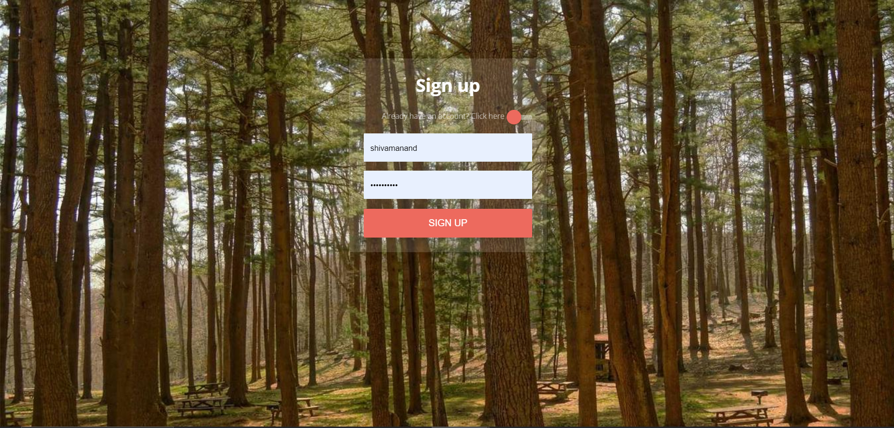
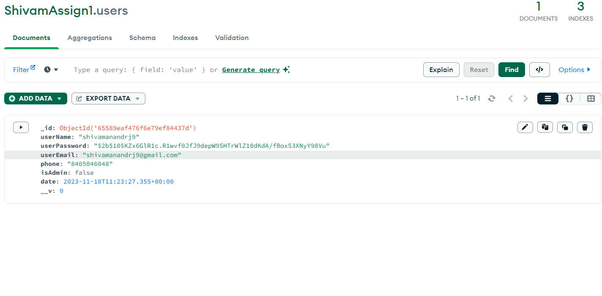
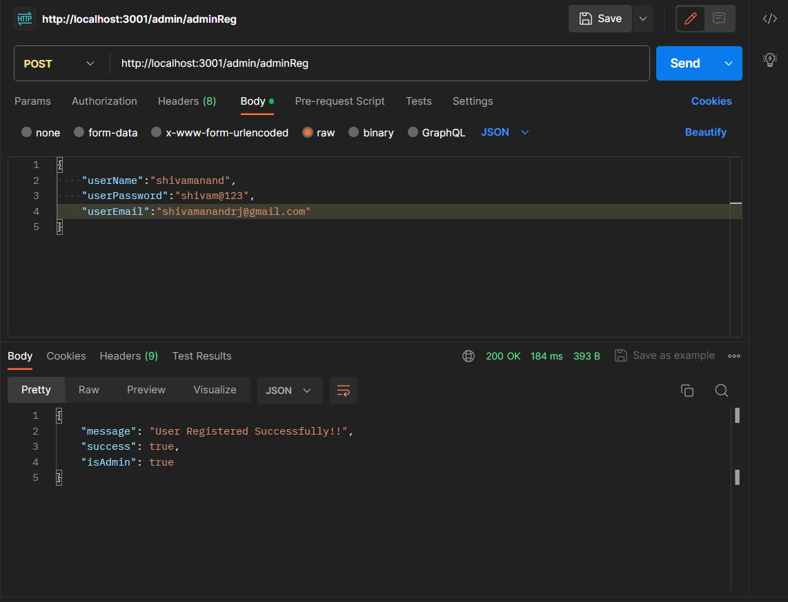
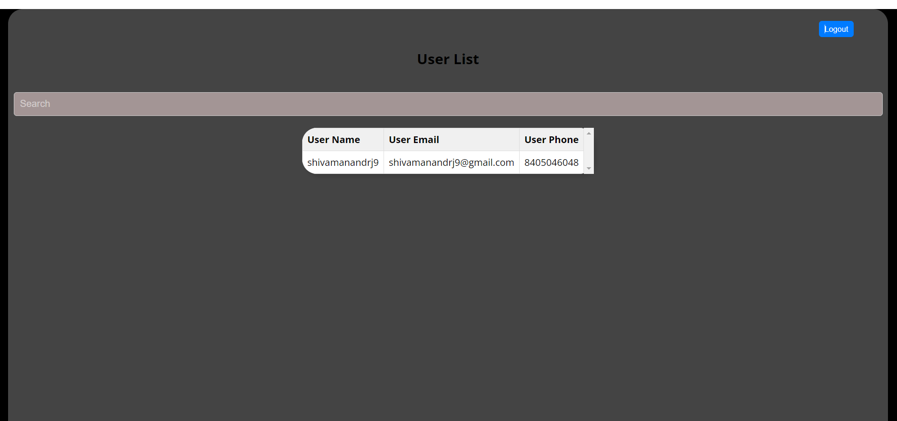

# Greenie-Assignment

Here is step by step instruction on how to run this application.

Step 1:
We start both the backend and frontend application using 'npm start'.

Step 2:
Once both have started, we can see the login and signup page.

Step 3:
We can use the toggle bar to switch between login and signup page.

Step 4:
Once you create an account, we can check it in database. Here I am using mongoDB

Step 5:
Now to see all the users of the app, we can create an admin account. Here I have done directly using POSTMAN by makin a POST request.

Step 6:
Once it is created, we can login using the admin credential to see all the users who has been registered.

Thanks.

